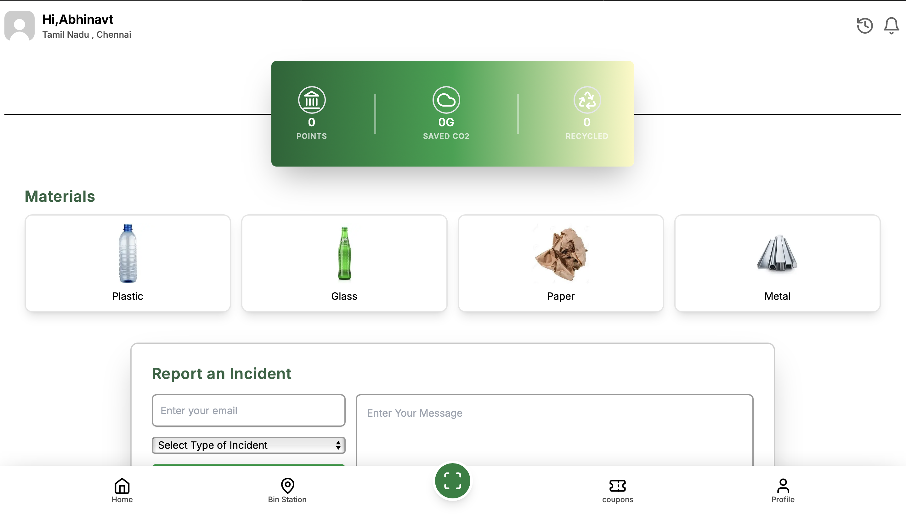
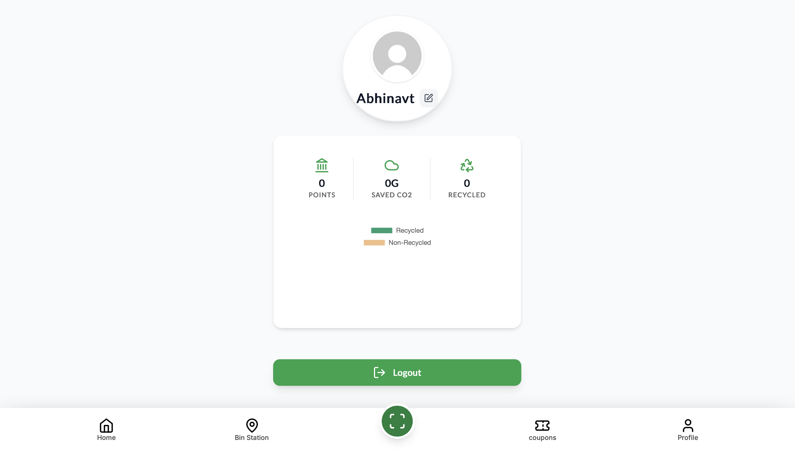
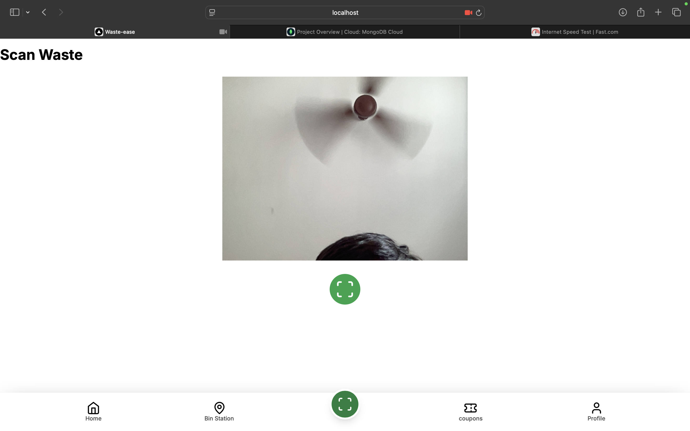
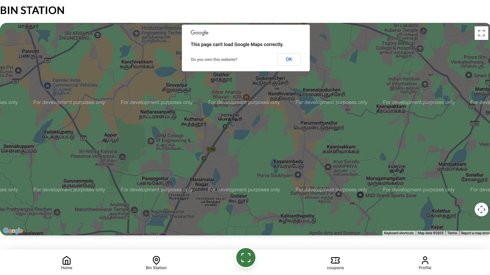

# RWMS

A modern, responsive, and minimalist waste management web app built with Next.js, Tailwind CSS, and TypeScript.

## 🚀 Live Demo
[https://rwms-7bhinavs-projects.vercel.app](https://rwms-7bhinavs-projects.vercel.app)

## 📸 Screenshots

| Home / Materials | Profile | Scan Waste | Bin Station (Google Maps) |
|---|---|---|---|
|  |  |  |  |

## Features
- User authentication (register, login, forgot password)
- Profile with stats and circular avatar
- Responsive dashboard with materials info and incident reporting
- Animated stats card with gradients
- Accessible, mobile-first design
- Scan waste, view coupons, and more

## Getting Started

### 1. Clone the repository
```
git clone https://github.com/7bhinav/RWMS.git
cd RWMS
```

### 2. Install dependencies (using Bun)
```
bun install
```

### 3. Run the development server
```
bun run dev
```

Open [http://localhost:3000](http://localhost:3000) to view the app.

## Deployment
- Deploy easily to [Vercel](https://vercel.com/) (recommended for Next.js)
- Or use your own Node.js server

## License
MIT

---
Made with ❤️ for the RSWM project.
